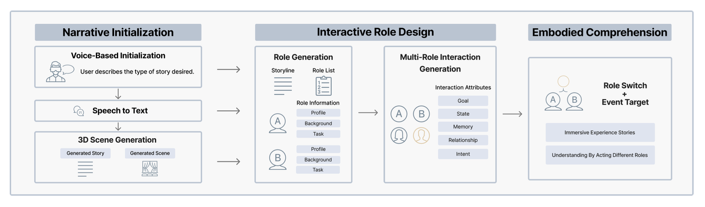

---

##### GenLARP System Pipeline



---

##### Abstract

We introduce <strong>GenLARP</strong>, a <strong>virtual reality (VR)</strong> system that transforms personalized stories into immersive live action role-playing
(LARP) experiences. GenLARP enables users to act as both <strong>creators and players</strong>, allowing them to design characters based on their
descriptions and live in the story world. Generative AI and agents powered by <strong>Large Language Models (LLMs)</strong> enrich these experiences.

---

##### Download

+ [Paper](GenLARP.pdf)
<!-- + [Online appendix](appendix1.pdf) -->
<!-- + [Code and data](https://github.com/pmichaillat/feru) -->

---

##### Citation (APA)

Yu, Y., Jiang, Y., Lui, M., & Jin, Q. (2025). GenLARP: Enabling immersive live action role play through LLM-generated worlds and characters. Proceedings of the IEEE International Symposium on Mixed and Augmented Reality Adjunct (ISMAR Adjunct ’25) (pp. 1–3). IEEE. https://doi.org/10.1109/ISMAR-Adjunct60698.2025.xxxxx
```BibTeX
@inproceedings{yu2025genlarp,
  author    = {Yu, Yichen and Jiang, Yifan and Lui, Mandy and Jin, Qiao},
  title     = {GenLARP: Enabling Immersive Live Action Role Play through LLM-Generated Worlds and Characters},
  booktitle = {Proceedings of the IEEE International Symposium on Mixed and Augmented Reality Adjunct (ISMAR Adjunct '25)},
  year      = {2025},
  publisher = {IEEE},
  pages     = {1--3},
  doi       = {10.1109/ISMAR-Adjunct60698.2025.xxxxx},
  isbn      = {978-1-6654-xxxx-x/25}
}
```

---

<!-- ##### Related material

+ [Presentation slides](presentation1.pdf)
+ [Summary of the paper](https://www.penguinrandomhouse.com/books/110403/unusual-uses-for-olive-oil-by-alexander-mccall-smith/) -->
