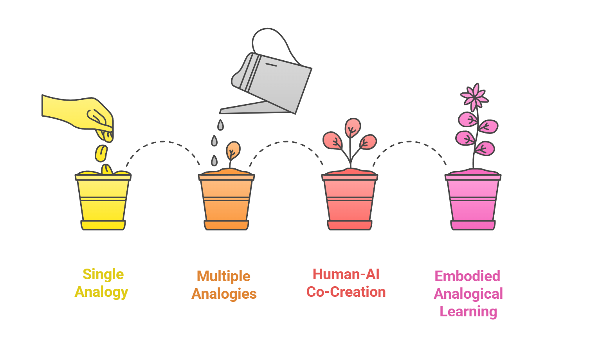
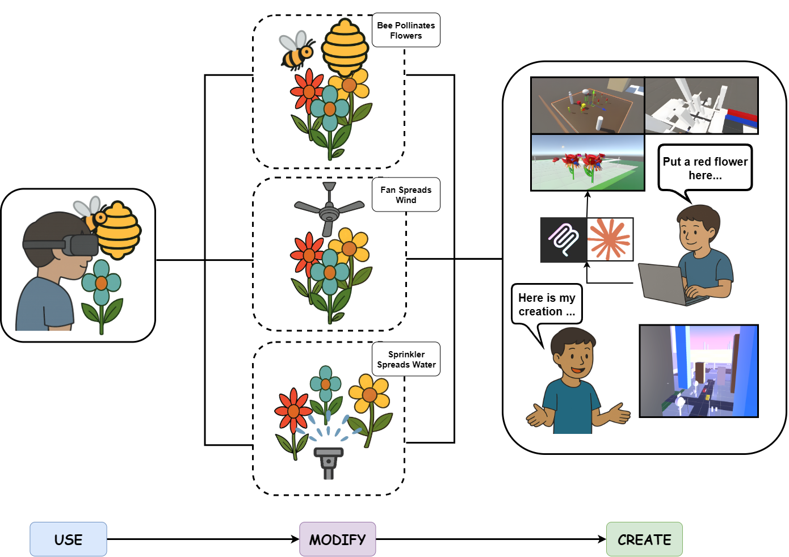
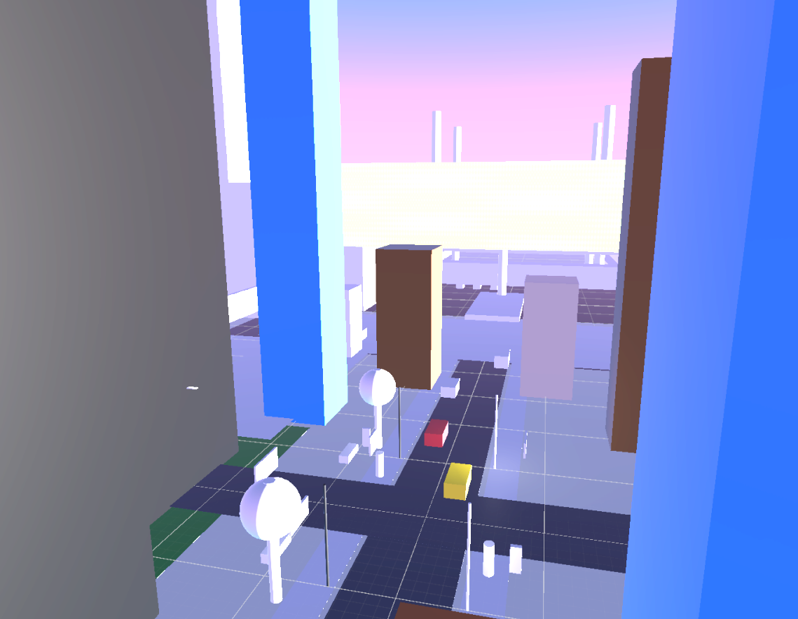
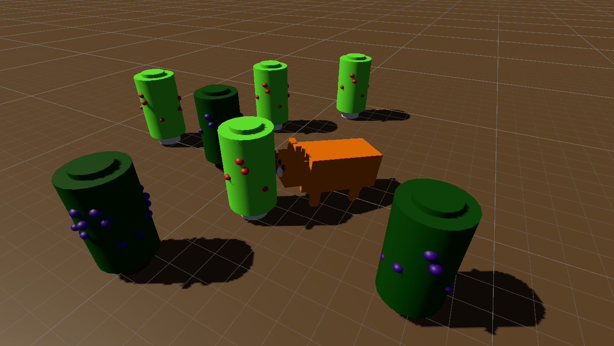
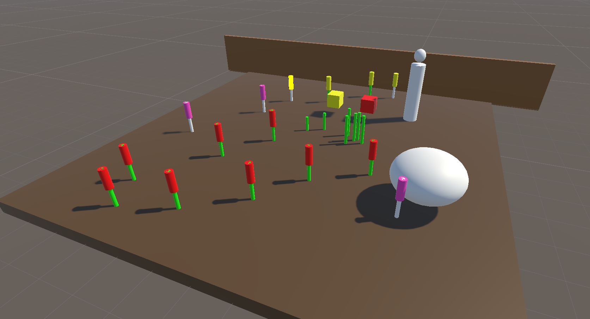

---

##### EmbodiedCreate Teaser


##### EmbodiedCreate Flowchart


---

##### Abstract

Making abstract concepts understandable to children remains challenging. <strong>Embodied analogies</strong> hold great promise for bridging this
gap; however, a single, fixed analogy is often employed in embodied learning environments, which risks surface-level understanding,
limiting knowledge transfer for new domains. We present <strong>EmbodiedCreate</strong>, a novel embodied learning activity that supports
analogical learning of AI concepts through the <strong>Use-Modify-Create</strong> process. It enables students to experience a single embodied analogy,
then modify multiple analogies capturing the same concepts, and finally create their own analogies. Through an exploratory study
with 17 students (8 high-school, 9 middle-school), we found that: (1) multiple analogies can promote knowledge construction, with
learners generating novel mappings between the target and source knowledge; and (2) the creation process supports learners to
externalize, critique, and refine their understanding of the AI concepts. Our findings also uncover design implications and challenges
of child-AI embodied co-creation for future educational technologies.

---

<div style="display: flex; gap: 20px; text-align: center;">
  <div style="flex: 1;">
    <h5>Student Created Analogy 1 (Urban Infrastructure)</h5>
    
  </div>
  <div style="flex: 1;">
    <h5>Student Created Analogy 2 (A Fox Picking Berries)</h5>
    
  </div>
  <div style="flex: 1;">
    <h5>Student Created Analogy 3 (A Gardener)</h5>
    
  </div>
</div>


<!-- ##### Download

+ [Paper](EmbodiedCreate.pdf) -->
<!-- + [Online appendix](appendix1.pdf) -->
<!-- + [Code and data](https://github.com/pmichaillat/feru) -->

<!-- ---

##### Citation (APA)

Yu, Y., Jiang, Y., Lui, M., & Jin, Q. (2025). GenLARP: Enabling immersive live action role play through LLM-generated worlds and characters. Proceedings of the IEEE International Symposium on Mixed and Augmented Reality Adjunct (ISMAR Adjunct ’25) (pp. 1–3). IEEE. https://doi.org/10.1109/ISMAR-Adjunct60698.2025.xxxxx
```BibTeX
@inproceedings{yu2025genlarp,
  author    = {Yu, Yichen and Jiang, Yifan and Lui, Mandy and Jin, Qiao},
  title     = {GenLARP: Enabling Immersive Live Action Role Play through LLM-Generated Worlds and Characters},
  booktitle = {Proceedings of the IEEE International Symposium on Mixed and Augmented Reality Adjunct (ISMAR Adjunct '25)},
  year      = {2025},
  publisher = {IEEE},
  pages     = {1--3},
  doi       = {10.1109/ISMAR-Adjunct60698.2025.xxxxx},
  isbn      = {978-1-6654-xxxx-x/25}
}
```

--- -->

<!-- ##### Related material

+ [Presentation slides](presentation1.pdf)
+ [Summary of the paper](https://www.penguinrandomhouse.com/books/110403/unusual-uses-for-olive-oil-by-alexander-mccall-smith/) -->
